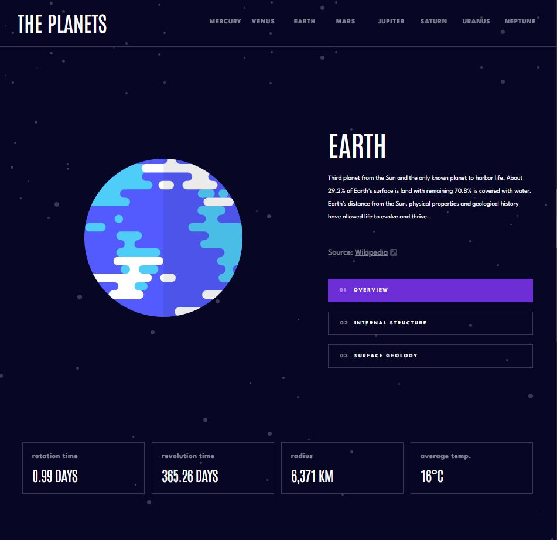
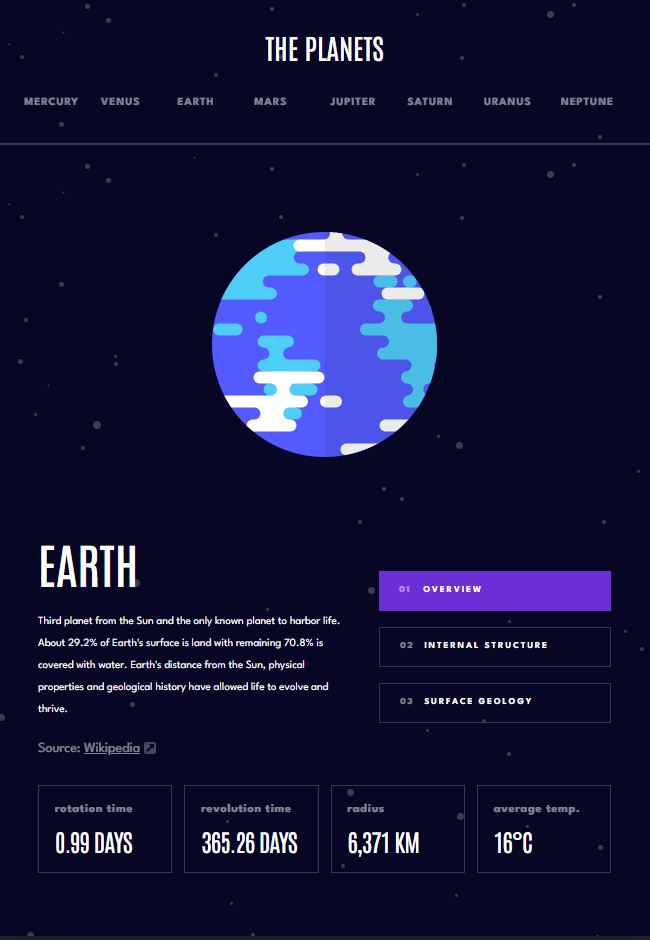
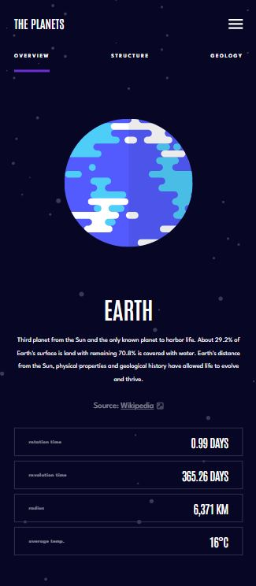

# Frontend Mentor - Planets fact site solution

This is a solution to the [Planets fact site challenge on Frontend Mentor](https://www.frontendmentor.io/challenges/planets-fact-site-gazqN8w_f). Frontend Mentor challenges help you improve your coding skills by building realistic projects.

## Table of contents

- [Overview](#overview)
  - [The challenge](#the-challenge)
  - [Screenshot](#screenshot)
  - [Links](#links)
- [My process](#my-process)
  - [Built with](#built-with)
  - [What I learned](#what-i-learned)
  - [Continued development](#continued-development)
  - [Useful resources](#useful-resources)
- [Author](#author)

## Overview

### The challenge

Users should be able to:

- View the optimal layout for the app depending on their device's screen size
- See hover states for all interactive elements on the page
- View each planet page and toggle between "Overview", "Internal Structure", and "Surface Geology"

### Screenshots

| Media   | Screenshot                                          |
| ------- | --------------------------------------------------- |
| Desktop |  |
| Tablet  |   |
| Mobile  |   |

### Links

- Live Site URL: [Planet Fact Site](https://your-live-site-url.com)

## My process

### Built with

- Semantic HTML5 markup
- CSS custom properties
- CSS lexbox
- Mobile-first workflow
- [React](https://reactjs.org/) - JS library
- React-router

**Note: These are just examples. Delete this note and replace the list above with your own choices**

### What I learned

#### React Library

It has been a while since I used React and React-router. The goal of this project for me was to re-familiarize myself with these libraries. One of the change was leveraging the `useEffect` hook which needed some refreshers.

#### Vite

This is my first time using Vite and there were many challenges. For example, I was not sure about how to set the base URL and have the assets called correctly. This needed some investigation to get right.

#### Preserving the size of the planets' image

One challenge I faced which I was particularly proud of was preserving the relative size of the planets while ensuring that the layout is not affected by this change in size. This was challenging because the SVGs had a native size set, but would be set to the same size by default.

This is achieved by fixing the size of the container that had the planet image with `display: flex` to set the planet image in the centre. There is a maximum width set on the figure and that it will take a width percentage, thus preserving its original relative size difference.

#### Using React-router for state management

Leveraging the react router for state management instead of useState hook. This allows for the state to be saved in the URL which can be shared. However, this didn't seem to go well with github hosted websites which are SPA. More investigation will be needed to see its utility.

#### Scroll locking during mobile navigation bar

To achieve locking the scrolling when the nav bar is on, I used `useEffect` hook that sets a side-effect dependency of a state `isMobileNavActive` Whenever this happens, I add an additional class to add the CSS `overflow: hidden` which stops scrolling when the navigation bar is activated.

## Author

- Frontend Mentor - [@anthonydwan](https://www.frontendmentor.io/profile/anthonydwan)
